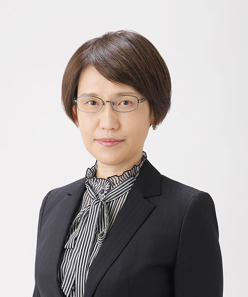

## Dr. Saori C Tanaka  
 

[**Google Scholar**](https://scholar.google.com/citations?user=Kysh6goAAAAJ&hl)

[**ORCID**](https://orcid.org/0000-0002-7001-5051)

## Affiliations
1. Computational Behavioral Neuroscience Lab, Division of Information Science, Nara Institute of Science and Technology ([web](https://cbns.naist.jp/en/))
2. Department of Neural Computation for Decision-Making, ATR Brain Information Communication Research Lab. Group ([web](https://bicr.atr.jp/ncd/en/))

## Short Bio
I began my research as a graduate student in computational neuroscience at the Nara Institute of Science and Technology (NAIST) in 2001. My early research established some of the first foundational computational models of decision-making, in particular my work on temporal discounting (Nature Neuroscience, 2004) has been cited >1000 times. and has had substantial impact on the development of the field. I received the Best Paper Award, Best Research Award, and Encouragement Award from the Japan Neural Networks Society in 2005 for this achievement. After completing graduate school, I continued my research on human decision-making and received the Nakayama Award for Encouragement from the Nakayama Science Foundation in 2008 for the theme of "Science of Emotion”.
With advances in data science, however, I became interested in fusing hypothesis-driven with data- driven approaches. Hence more recently, I have been involved in national flagship neuroscience projects funded by MEXT and AMED by leading in building databases to make MRI data from thousands of patients with human diseases publicly available (Tanaka et al., 2022, Scientific Data). Compared to other countries, Japan lags behind in data sharing, and there is an urgent need to improve policies and systems, and to secure human resources. I am now recognised as a leader of open science in the field of brain imaging in Japan, thanks to my expertise and skills in computational neuroscience, as well as the networks I have built with overseas researchers through invitations to several meetings of the International Brain Initiative (IBI).
In parallel with my research activities, I have actively contributed to developing the research field as a program committee member of various academic societies. As a representative of our society, I am also a member of the Future Plan Committee of the Japanese Association of Brain Science Societies, which consists of 19 basic and clinical brain science-related societies in Japan, and I have made proposals to the government, the public, and academic societies on future plans for brain science research. Specifically, I proposed the application of artificial intelligence technology and databases as essential areas of neuroscience in Japan's science policy.

## Biography
Professor (tenure-track), 2025.4 –
Division of Information Science, Nara Institute of Science and Technology, Japan

Associate Professor (tenure-track), 2022.4 – 2025.3
Division of Information Science, Nara Institute of Science and Technology, Japan

Department Head, 2015.9 –
Department of Neural Computation for Decision-making (NCD), ATR Brain Information Communication Research Lab. Group

Senior Researcher, 2015.4 – 2015.9
Researcher, 2014.1 – 2015.3
Department of Cognitive Neuroscience (DCN), ATR Brain Information Communication Research Lab. Group, Japan

Associate Professor, 2012 – 2013
Associate Professor (project appointed), 2009 – 2012
Institute of Social and Economic Research, Osaka University, Japan

Researcher, 2007 – 2008
Department of Computational Biology, ATR Brain Information Communication Research Lab. Group

Postdoc fellow, 2006 – 2007
Human Reward Learning Laboratory (John O’Doherty lab)
Division of Humanities and Social Sciences
California Institute of Technology

Ph. D. Candidate, 2003 – 2006
Graduate School of Information Science, Nara Institute of Science and Technology, Japan

Master of Science, 2001 – 2003
Graduate School of Information Science, Nara Institute of Science and Technology, Japan

Bachelor of Science, 1997 – 2001
Department of Physics, Faculty of Science, Osaka University, Japan

## Publications
1.	Takahara Y, Kashiwagi Y, Tokuda T, Yoshimoto J, Sakai Y, Yamashita A, Yoshioka T, Takahashi H, Mizuta H, Kasai K, Kunimitsu A, Okada N, Itai E, Shinzato H, Yokoyama S, Masuda Y, Mitsuyama Y, Okada G, Okamoto Y, Itahashi T, Ohta H, Hashimoto RI, Harada K, Yamagata H, Matsubara T, Matsuo K, Tanaka SC, Imamizu H, Ogawa K, Momosaki S, Kawato M, Yamashita O. Comprehensive evaluation of pipelines for classification of psychiatric disorders using multi-site resting-state fMRI datasets. Neural Netw. 187, 107335, 2025.
2.	Shinsuke Koike, Saori C Tanaka, Takuya Hayashi Beyond case-control study in neuroimaging for psychiatric disorders: Harmonizing and utilizing the brain images from multiple sites. Neuroscience and biobehavioral reviews 171, 106063, 2025
3.	Tanaka SC et al. Comprehensive evaluation of pipelines for classification of psychiatric disorders using multi-site resting-state fMRI datasets. Neural networks 187, 107335, 2025
4.	Itahashi T, Yamashita A, Takahara Y, Yahata N, Aoki YY, Fujino J, Yoshihara Y, Nakamura M, Aoki R, Okimura T, Ohta H, Sakai Y, Takamura M, Ichikawa N, Okada G, Okada N, Kasai K, Tanaka SC, Imamizu H, Kato N, Okamoto Y, Takahashi H, Kawato M, Yamashita O, Hashimoto RI. Generalizable and transportable resting-state neural signatures characterized by functional networks, neurotransmitters, and clinical symptoms in autism, Molecular Psychiatry, 30(4), 1466–1478, 2025.
5.	Tanaka SC et al. The status of MRI databases across the world focused on psychiatric and neurological disorders, Psychiatry and Clinical Neurosciences78（10）, 563-579, 2024
6.	Morishita T, Sakai Y, Iida H, Tanaka H, Permana GI, Kobayashi H, Tanaka SC, Abe H. Surgical Concepts and Long-term Outcomes of Thalamic Deep Brain Stimulation in Patients with Severe Tourette Syndrome: A Single-center Experience. Neurol Med Chir (Tokyo) Published online June 19, 2024.
7.	Kawashima I, Hinuma T, Nagata M, Yoneyama A, Honjo M, Kumano H, Tanaka SC. Psychometric properties of the Japanese version of the standardised assessment of personality abbreviated scale. Frontiers in Psychology 14, 1339902, 2024
8.	Morishita T, Sakai Y, Iida H, Yoshimura S, Fujioka S, Oda K, Tanaka SC, Abe H. Precision Mapping of Thalamic Deep Brain Stimulation Lead Positions Associated With the Microlesion Effect in Tourette Syndrome. Neurosurgery 93(4), 875-883, 2023
9.	Hamamura T, Kobayashi N, Oka T, Kawashima I, Sakai Y, Tanaka SC, Honjo M. Validity, reliability, and correlates of the Smartphone Addiction Scale–Short Version among Japanese adults. BMC Psychology 11(1), 78, 2023
10.	Nakamura Y, Ishida T, Tanaka SC, Mitsuyama Y, Yokoyama S, Shinzato H, Itai E, Okada G, Kobayashi Y, Kawashima T, Miyata J, Yoshihara Y, Takahashi H, Aoki R, Nakamura M, Ota H, Itahashi T, Morita S, Kawakami S, Abe O, Okada N, Kunimatsu A, Yamashita A, Yamashita O, Imamizu H, Morimoto J, Okamoto Y, Murai T, Hashimoto RI, Kasai K, Kawato M, Koike S. Distinctive alterations in the mesocorticolimbic circuits in various psychiatric disorders. Psychiatry and Clinical Neurosciences 77(6), 345-354, 2023
11.	Ishida T, Nakamura Y, Tanaka SC, Mitsuyama Y, Yokoyama S, Shinzato H, Itai E, Okada G, Kobayashi Y, Kawashima T, Miyata J, Yoshihara Y, Takahashi H, Morita S, Kawakami S, Abe O, Okada N, Kunimatsu A, Yamashita A, Yamashita O, Imamizu H, Morimoto J, Okamoto Y, Murai T, Kasai K, Kawato M, Koike S. Aberrant Large-Scale Network Interactions Across Psychiatric Disorders Revealed by Large-Sample Multi-Site Resting-State Functional Magnetic Resonance Imaging Datasets. Schizophrenia bulletin 49(4), 933-943, 2023
12.	Kawashima I, Hinuma T, Tanaka SC. Ecological momentary assessment of mind-wandering: meta-analysis and systematic review. Scientific Reports 13(1), 2023
13.	Kawashima I, Nagahama T, Kumano H, Momose K, Tanaka SC. Pavlovian-based neurofeedback enhances meta-awareness of mind-wandering. Neural Networks 158, 239-248, 2022
14.	Sakai Y, Sakai Y, Abe Y, Narumoto J, Tanaka SC. Memory trace imbalance in reinforcement and punishment systems can reinforce implicit choices leading to obsessive-compulsive behavior. Cell Reports 40(9), 111275, 2022
15.	Kasai K, Yagishita S, Tanaka SC, Koike S, Murai T, Nishida A, Yamasaki S, Ando S, Kawakami N, Kanehara A, Morita K, Kumakura Y, Takahashi Y, Sawai Y, Uno A, Sakakibara E, Okada N, Okamoto Y, Nochi M, Kumagaya SI, Fukuda M. Personalized values in life as point of interaction with the world: Developmental/neurobehavioral basis and implications for psychiatry. Psychiatry and Clinical Neurosciences Report 1(2), e12, 2022
16.	Kurokawa R, Kamiya K, Koike S, Nakaya M, Uematsu A, Tanaka SC, Kamagata K, Okada N, Morita K, Kasai K, Abe O. Cross-scanner reproducibility and harmonization of a diffusion MRI structural brain network: A traveling subject study of multi-b acquisition. NeuroImage 245, 118675, 2021
17.	Suzuki Y, Tanaka SC. Functions of the ventromedial prefrontal cortex in emotion regulation under stress. Scientific Reports 11(7), 18225, 2021
18.	Tanaka SC, Yamashita A, Yahata N, Itahashi T, Lisi G, Yamada T, Ichikawa N, Takamura M, Yoshihara Y, Kunimatsu A, Okada N, Hashimoto R, Okada G, Sakai Y, Morimoto J, Narumoto J, Shimada Y, Mano H, Yoshida W, Seymour B, Shimizu T, Hosomi K, Saitoh Y, Kasai K, Kato N, Takahashi H, Okamoto Y, Yamashita O, Kawato M and Imamizu H. A multi-site, multi-disorder resting-state magnetic resonance image database. Scientific Data 8, 227, 2021
19.	Maikusa N, Zhu Y, Uematsu A, Yamashita A, Saotome K, Okada N, Kasai K, Okanoya K, Yamashita O, Tanaka SC, Koike S. Comparison of traveling-subject and ComBat harmonization methods for assessing structural brain characteristics. Human Brain Mapping 42(16), 5278–5287, 2021
20.	Morishita T, Sakai Y (co-first author), Iida H, Yoshimura S, Ishii A, Fujioka S, Tanaka SC, and Inoue T. Neuroanatomical considerations for optimizing thalamic deep brain stimulation in Tourette syndrome. Journal of Neurosurgery, 1-11, 2021
21.	Takagi Y, Okada N, Ando S, Yahata N, Morita K, Koshiyama D, Kawakami S, Sawada K, Koike S, Endo K, Yamasaki S, Nishida A, Kasai K, Tanaka SC. Intergenerational transmission of the patterns of functional and structural brain networks. iScience 24(7), 102708, 2021
22.	Nakamura Y, Ando S, Yamasaki S, Okada N, Nishida A, Kasai K, Tanaka SC, Nakatani H, and Koike S. Dietary Restraint Related to Body Weight Maintenance and Neural Processing in Value-Coding Areas in Adolescents. The Journal of nutrition 151(7), 2059–2067, 2021
23.	Cortese A, Tanaka SC, Amano K, Koizumi A, Lau H, Sasaki Y, Shibata K, Taschereau-Dumouchel V, Watanabe T, and Kawato M. The DecNef collection, fMRI data from closed-loop decoded neurofeedback experiments. Scientific data 8(1), 65–65, 2021
24.	Morishita T, Sakai Y (co-first author), Mishima T, Umemoto G, Okun MS, Tanaka SC, Tsuboi Y, and Inoue T. Case Report: GPi DBS for Non-parkinsonian Midline Tremor: A Normative Connectomic Comparison to a Failed Thalamic DBS. Frontiers in Human Neuroscience 15, 406, 2021
25.	Yamashita A, Sakai Y, Yamada T, Yahata N, Kunimatsu A, Okada N, Itahashi T, Hashimoto R, Mizuta H, Ichikawa N, Takamura M, Okada G, Yamagata H, Harada K, Matsuo K, Tanaka SC, Kawato M, Kasai K, Kato N, Takahashi H, Okamoto Y, Yamashita O, and Imamizu H. Common Brain Networks Between Major Depressive-Disorder Diagnosis and Symptoms of Depression That Are Validated for Independent Cohorts. Frontiers in Psychiatry 12, 667881, 2021.
26.	Koike S, Tanaka SC, Tomohisa Okada, Toshihiko Aso, Yamashita A, Yamashita O, Michiko Asano, Norihide Maikusa, Morita K, Okada N, Fukunaga M, Uematsu A, Togo H, Miyazaki A, Murata K, Urushibata Y, Autio J, Ose T, Yoshimoto J, Araki T, Glasser MF, Van Essen DC, Maruyama M, Sadato N, Kawato M, Kasai K, Okamoto Y, Hanakawa T, and Hayashi T. Brain/MINDS beyond human brain MRI project: A protocol for multi-level harmonization across brain disorders throughout the lifespan. NeuroImage. Clinical 30, 102600, 2021
27.	Yamashita A, Sakai Y, Yamada T, Yahata N, Kunimatsu A, Okada N, Itahashi T, Hashimoto R, Mizuta H, Ichikawa N, Takamura M, Okada G, Yamagata H, Harada K, Matsuo K, Tanaka SC, Kawato M, Kasai K, Kato N, Takahashi H, Okamoto Y, Yamashita O, Imamizu H. Generalizable brain network markers of major depressive disorder across multiple imaging sites. PLoS Biology 18(12), e3000966, 2020
28.	Kawakami N, Watanabe K, Nishi D, Takagi D, Hashimoto H, Tanaka SC. Time preference and personal value: a population-based cross-sectional study in Japan. BMC Psychol. 8(1), 85, 2020
29.	Iijima Y, Okumura Y, Yamasaki S, Ando S, Okada K, Koike S, Endo K, Morimoto Y, Williams A, Murai T, Tanaka SC, Hiraiwa-Hasegawa M, Kasai K, Nishida A. Assessing the hierarchy of personal values among adolescents: A comparison of rating scale and paired comparison methods. J Adolesc. 80, 53-59, 2020
30.	He TS, Riyanto YE, Tanaka SC, Yamada K. Pronoun drop and prosocial behavior: experimental evidence from Japan. J Econ Sci Assoc 6, 13–25, 2020
31.	Takagi Y, Hirayama JI, Tanaka SC. State-unspecific patterns of whole-brain functional connectivity from resting and multiple task states predict stable individual traits. NeuroImage 201, 116036, 2019
32.	Okada N, Ando S, Sanada M, Hirata-Mogi S, Iijima Y, Sugiyama H, Shirakawa T, Yamagishi M, Kanehara A, Morita M, Yagi T, Hayashi N, Koshiyama D, Morita K, Sawada K, Ikegame T, Sugimoto N, Toriyama R, Masaoka M, Fujikawa S, Kanata S, Tada M, Kirihara K, Yahata N, Araki T, Jinde S, Kano Y, Koike S, Endo K, Yamasaki S, Nishida A, Hiraiwa-Hasegawa M, Bundo M, Iwamoto K, Tanaka SC, Kasai K. Population-neuroscience study of the Tokyo TEEN Cohort (pn-TTC): Cohort longitudinal study to explore the neurobiological substrates of adolescent psychological and behavioral development. Psychiatry and Clinical Neurosciences 73(5), 231-242, 2019
33.	Yamashita A, Yahata N, Itahashi T, Lisi G, Yamada T, Ichikawa N, Takamura M, Yoshihara Y, Kunimatsu A, Okada N, Yamagata H, Matsuo K, Hashimoto R, Okada G, Sakai Y, Morimoto J, Narumoto J, Shimada Y, Kasai K, Kato N, Takahashi H, Okamoto Y, Tanaka SC, Kawato M, Yamashita O, Imamizu H. Harmonization of resting-state functional MRI data across multiple imaging sites via the separation of site differences into sampling bias and measurement bias. PLoS biology 17(4), e3000042, 2019
34.	Yamashita M, Yoshihara Y, Hashimoto R, Yahata N, Ichikawa N, Sakai Y, Yamada T, Matsukawa N, Okada G, Tanaka SC, Kasai K, Kato N, Okamoto Y, Seymour B, Takahashi H, Kawato M, Imamizu H. A prediction model of working memory across health and psychiatric disease using whole-brain functional connectivity. elife 10(7), e38844, 2018
35.	Todokoro A, Tanaka SC, Kawakubo Y, Yahata N, Ishii-Takahashi A, Nishimura Y, Kano Y, Ohtake F, Kasai K. Deficient neural activity subserving decision-making during reward waiting time in intertemporal choice in adult attention-deficit hyperactivity disorder. Psychiatry and Clinical Neurosciences 72(8), 580-590, 2018
36.	Takagi Y, Sakai Y, Abe Y, Nishida S, Harrison BJ, Martínez-Zalacaín I, Soriano-Mas C, Narumoto J, Tanaka SC. A common brain network among state, trait, and pathological anxiety from whole-brain functional connectivity. NeuroImage 172, 506-516, 2018
37.	Tanaka SC, Yahata N, Todokoro A, Kawakubo Y, Kano Y, Nishimura Y, Ishii-Takahashi A, Ohtake F & Kasai K. Preliminary evidence of altered neural response during intertemporal choice of losses in adult attention-deficit hyperactivity disorder. Scientific Reports 8(1), 6703, 2018
38.	Takagi Y, Sakai Y, Lisi G, Yahata N, Abe Y, Nishida S, Nakamae T, Morimoto J, Kawato M, Narumoto J, Tanaka SC. A Neural Marker of Obsessive-Compulsive Disorder from Whole-Brain Functional Connectivity. Scientific Reports 7(1), 7538, 2017
39.	Fermin AS, Yoshida T, Yoshimoto J, Ito M, Tanaka SC, Doya K. Model-based action planning involves cortico-cerebellar and basal ganglia networks. Scientific Reports 6, 31378, 2016
40.	Tanaka SC, Yamada K, Kitada R, Tanaka S, Sugawara SK, Ohtake F, Sadato N: Overstatement in happiness reporting with ordinal, bounded scale. Scientific Reports 6, 21321, 2016
41.	Tanaka SC, Yamada K, Yoneda H, Ohtake F. Neural Mechanisms of Gain–Loss Asymmetry in Temporal Discounting. The Journal of Neuroscience 34(16), 5595-5602, 2014.
42.	Demoto Y, Okada G, Okamoto Y, Kunisato Y, Aoyama S, Onoda K, Munakata A, Nomura M, Tanaka SC, Schweighofer N, Doya K, Yamawaki S. Neural and personality correlates of individual differences related to the effects of acute tryptophan depletion on future reward evaluation. Neuropsychobiology 65(2), 55-64, 2012
43.	Onoda K, Okamoto Y, Kunisato Y, Aoyama S, Shishida K, Okada G, Tanaka SC, Schweighofer N, Yamaguchi S, Doya K, Yamawaki S. Inter-individual discount factor differences in reward prediction are topographically associated with caudate activation. Experimental brain research 212(4), 593-601, 2011
44.	Tanaka SC, Shishida K, Schweighofer N, Okamoto Y, Yamawaki S, Doya K. Serotonin affects association of aversive outcomes to past actions. The Journal of Neuroscience 29(50), 15669 – 15674, 2009
45.	Tanaka SC, Balleine BW, O'Doherty JP. Calculating Consequences: Brain Systems That Encode the Causal Effects of Actions. The Journal of Neuroscience 28(26), 6750 – 6755, 2008
46.	Schweighofer N, Bertin M, Shishida K, Okamoto Y, Tanaka SC, Yamawaki S, Doya K, Low-serotonin levels increase delayed reward discounting in humans. The Journal of Neuroscience 28(17), 4528-32, 2008
47.	Tanaka SC, Schweighofer N, Asahi S, Shishida K, Okamoto Y, Yamawaki　S, Doya K.. Serotonin Differentially Regulates Short- and Long-Term Prediction of Rewards in the Ventral and Dorsal Striatum. PLoS ONE 2(12), e1333, 2007
48.	Tanaka SC, Samejima K., Okada G, Ueda K, Okamoto Y, Yamawaki S, and Doya K. Brain mechanism of reward prediction under predictable and unpredictable environmental dynamics. Neural Networks 9(8), 1233-1241, 2006
49.	Schweighofer N, Shishida K, Han CE, Okamoto Y, Tanaka SC, Yamawaki S, Doya K. Humans can adopt optimal discounting strategy under real-time constraints. PLoS Computational Biology 2(11), e152, 2006
50.	Tanaka SC, Doya K, Okada G, Ueda K, Okamoto Y, and Yamawaki S. Prediction of Immediate and Future Rewards Differentially Recruits Cortico-Basal Ganglia Loops. Nature Neuroscience 7(8), 887-893, 2004

## Selected Talks (at international conferences and symposiums)
1.	Tanaka SC. The status of MRI databases across the world focused on psychiatric and neurological disorders. 23rd IEEE/WIC International Conference on Web Intelligence and Intelligent Agent Technology, December 2024
2.	Tanaka SC. Multi-site, multi-disease MRI database and applied research. Symposium, NEURO2024, July 2024
3.	Ogishima H, Tanaka SC. Constructing a Computational Model of Pain Based on the Free Energy Principle: Realizing the Interaction Between Beliefs and Perceptions. NEURO2024, July 2024
4.	Nakagawa A, Tanaka SC. Subtyping of Problematic Smartphone Use (PSU) by multivariable questionnaire of individual characteristics and smartphone use. NEURO2024, July 2024
5.	Hinuma H, Kawashima I, Nagata M, Yoneyama A, Honjo M, Kumano H, and Tanaka SC. Reliability and validity of the Japanese version of the SAPAS. 33rd International Congress of Psychology, July 2024
6.	Kawashima I, Hinuma H, Tanaka SC. Ecological Momentary Assessment of Mind-Wandering: Meta-Analysis and Systematic Review, 33rd International Congress of Psychology, July 2024
7.	Tanaka SC. Utilization of large-scale brain image database for digitalization of psychiatric and neurological disorders (Plenary Talk), IEEE World Congress on Computational Intelligence 2024 (WCCI2024), July 2024
8.	Sakai Y, Morishita T, Sakai Y, Tanaka SC. Chronic Deep Brain Stimulation Normalizes the Memory Trace Imbalance in Tourette Syndrome. The 46th Annual Meeting of the Japan Neuroscience Society, August 2023
9.	Tanaka SC. Toward the integration of data-driven and computational-based approaches using the large-scale neuro-behavioral database, The 46th Annual Meeting of the Japan Neuroscience Society, August 2023
10.	Yamashita A, Sakai Y, Yamada T, Yahata N, Kunimatsu A, Okada N, Itahashi T, Hashimoto RI, Mizuta H, Ichikawa N, Takamura M, Okada G, Yamagata H, Harada K, Matsuo K, Tanaka SC, Kawato M, Kasai K, Kato N, Takahashi H, Okamoto Y, Imamizu H, Yamashita O. Unsupervised-based feature selection method robustly extracted resting state functional connectivity related to major depressive disorder, SfN 2023, October 2023
11.	Itahashi T, Yamashita A, Takahara Y, Yahata N, Fujino J, Yoshihara Y, Nakamura M, Aoki YY, Aoki R, Ohta H, Sakai Y, Takamura M, Ichikawa N, Okada G, Okada N, Kasai K, Tanaka SC, Imamizu H, Kato N, Okamoto Y, Takahashi H, Kawato M, Yamashita O, Hashimoto RI. Generalizable neuromarker for autism spectrum disorder across imaging sites and developmental stages: A multi-site study, SfN 2023, October 2023
12.	Tanaka SC. Data collection and sharing in Brain/MINDS Beyond human brain MRI project. IBI Data Standards and Sharing WG Symposium, November 2022
13.	Yamashita A, Sakai Y, Yamada T, Yahata N, Kunimatsu A, Okada N, Itahashi T, Hashimoto RI, Mizuta H, Ichikawa N, Takamura M, Okada G, Yamagata H, Harada K, Matsuo K, Tanaka SC, Kawato M, Kasai K, Kato N, Takahashi H, Okamoto Y, Imamizu H. Hierarchical supervised/unsupervised approach for subtype and redefine psychiatric disorders using a harmonized multi-site multi-disorder resting state functional magnetic resonance imaging, BPCNPNPPP4, November 2022
14.	Tanaka SC. Utilization of large-scale neuroimaging data in neuropsychiatric research. 43rd Annual Meeting of the Japan Neuroscience Society, July 2020
15.	Tanaka SC, Sakai Y, Sakai Y. Computational model of repetitive behavior observed in psychiatric disorders. Decision Neuroscience meeting 2016, Sydney, Australia, December 2016 
16.	Tanaka SC, Neurocomputational model for reward prediction and decision making in psychiatric disorders. 30th World Congress of Neuropsychopharmacology (CINP2016), Seoul, Korea, July 2016
17.	Tanaka SC, Sakai Y, Sakai Y. Computational model of impulsive reaction to anxiety in Obsessive-Compulsive Disorder. 2nd Multi-disciplinary Conference on Reinforcement Learning and Decision Making (RLDM2015), Edmonton, Alberta, Canada, June 2015
18.	Yamada K, Tanaka SC, Kitada R, Sugawara S, Takahashi H, Ohtake F, Sadato N. Neural mechanism of social preferences toward reference persons of the same and different gender, Society for Neuroscience 44th Annual Meeting (Neuroscience2014). Washington DC, USA, November 2014
19.	Tanaka SC, Takaoka M, Yoneda H, Enomoto K, Samejima K, Haruno M, Kimura M, and Ohtake F. Striatal event-related activity reflects intrinsic discount rate in a multi-step reward task. Neuro 2013, Kyoto, July 2013
20.	Tanaka SC, Neurocomputational model for reward prediction and decision making. 11th World Congress of Biological Psychiatry, Kyoto, July 2013
21.	Tanaka SC, Yoneda H and Ohtake F. The sign effect of delay discounting, Neuro 2010, Kobe, September 2010
22.	Tanaka SC. Prospective and retrospective learning with delayed reward; Delay discounting and eligibility trace, The 32th Annual Meeting of Japan Neuroscience Society, Nagoya, September 2009
23.	Tanaka SC, Balleine BW, O'Doherty JP (2008). Calculating Consequences: Brain Systems That Encode the Causal Effects of Actions. The 31st Annual Meeting of the Japan Neuroscience Society, Tokyo, July 2008
24.	Schweighofer N, Tanaka SC, Shishida K, Bertin M, Han C, Okamoto Y, Yamawaki S, Doya K (2007). Role of serotonin in delayed reward choice in humans. Computational and Systems Neuroscience (COSYNE 07), Salt Lake City, June 2007
25.	Tanaka SC, Shishida K, Schweighofer N, Okamoto Y, Yamawaki S, Doya K (2005). Serotonin affects temporal credit assignment in delayed stimulus-outcome association learning. Society for neuroscience 35th annual meeting, Washington D.C., November 2005
26.	Tanaka SC, Schweighofer N, Asahi S, Okamoto Y, Yamawaki S, Doya K (2004). An fMRI study of the delay discounting of reward after tryptophan depletion and loading. 2: reward expectation. Society for neuroscience 34th annual meeting, San Diego, October 2004
27.	Tanaka S, Doya K, Okada G, Ueda Y, Okamoto Y, Yamawaki S (2003). Prediction of Immediate and Future Rewards Differentially Recruits Cortico-Basal Ganglia Loops. Society for Neuroscience 33rd Annual Meeting, New Orleans, November 2003
28.	Tanaka SC, Doya K, Okada G, Ueda Y, Okamoto Y, Yamawaki S. Functional MRI study of short-term and long-term prediction of reward. 8th International Conference on Functional Mapping of the Human Brain, Sendai, June 2002

## Funding
**Current research funding**
1. FY2021-FY2025, Grant-in-Aid for Transformative Research Areas A, Japan Society for the Promotion of Science (JSPS), “Human behavioral science for subjectification ("tojisha-ka") by interaction-based & rule-/story-based understanding of the brain & the world.”, Principal Investigator
2. FY2021-FY2025, Innovative Science and Technology Initiative for Security Grant, Acquisition, Technology & Logistics Agency, “Elucidating brain mechanisms of metacognition and constructing daily training environment”, Co-Investigator
3. FY2022-FY2026, Moonshot R&D Program, Japan Science and Technology Agency (JST), “Integration of Asian humanities and brain informatics to enhance peace and compassion of the mind”, Principal Investigator
4. FY2023-FY2029, The Strategic International Brain Science Research Promotion Program (Brain/MINDS 2.0), Japan Agency for Medical Research and Development (AMED), “Integrative MRI data platform across the lifespan and disorders toward international brain science collaborations”, Co-Investigator

**Funding received in the last five years**
1. FY2018-FY2023, The Strategic International Brain Science Research Promotion Program (Brain/MINDS Beyond), Japan Agency for Medical Research and Development (AMED), “Integrative MRI data platform across the lifespan and disorders toward international brain science collaborations”, Co-Investigator
2. FY2018-FY2020, Research and Development Grants for Comprehensive Research for Persons with Disabilities(Mental Disorder Area), AMED, “Development of fMRI neurofeedback methods for gambling disorders”, Co-Investigator
3. FY2017-FY2019, Research and Development Grants for Comprehensive Research for Persons with Disabilities(Mental Disorder Area), AMED, “Investigating the Effectiveness of Pharmacotherapy in Addiction Patients and Developing fMRI-Based Biomarkers”, Co-Investigator
4. FY2016-FY2021, Commissioned research on R&D of advanced communications and broadcasting, National Institute of Information and Communications Technology, “Research and development of technology for enhancing functional recovery of elderly and disabled people based on non-invasive brain imaging and robotic assistive devices”, Co-Investigator
5. FY2016-FY2020, Grants-in-Aid for Scientific Research, JSPS, “Science of personalized value development through adolescence: integration of brain, real-world, and life-course approaches of brain, real-world, and life-course approaches”, Principal Investigator

## To join us
Our lab focuses on modeling the brain and behavior using computational, statistical, and machine learning approaches. We are looking for motivated students who are curious about how the mind works, enjoy working with data, and are excited about interdisciplinary research across neuroscience, psychology, and artificial intelligence.

We welcome applications from students of diverse backgrounds including but not limited to:
- Information science / computer science
- Cognitive science / psychology
- Neuroscience / biomedical engineering

Opportunities are available for:
- Master’s and doctoral programs (at NAIST)
- Undergraduate research internships
- Visiting students from other universities

What we offer:
- A supportive, collaborative, and international research environment
- Opportunities to work on real datasets and publish your work
- Guidance in both theoretical and practical aspects of research

If you are interested in joining us, please contact us at cbns-info @ ml.naist.ac.jp with a brief introduction and your academic background. We also welcome lab visits and online info sessions—feel free to reach out!

## Contact
Please contant me from the [Google form](https://forms.gle/UuJZVTnRHVPeLAWB7) or cbns-info @ ml.naist.ac.jp.

